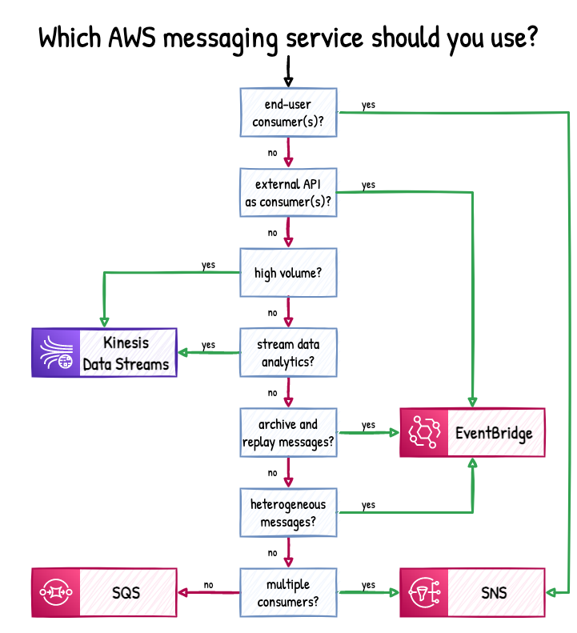
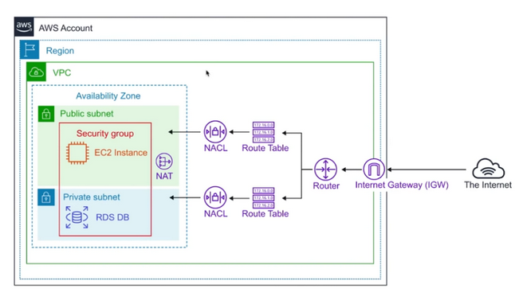

# AWS Services Comparison

# Kinesis vs SNS vs SQS vs EventBridge

# Security Group vs NACL vs Route Tables

### Security Group

A security group acts as a virtual firewall for your instance to control inbound and outbound traffic. When you launch
an instance in a VPC, you can assign up to five security groups to the instance.

**Security groups act at the instance level, not the subnet level**. Therefore, each instance in a subnet in your VPC
can be assigned to a different set of security groups.

The following are the basic characteristics of security groups for your VPC:

* Security Group rules are based on ALLOWs and there is no concept of DENY when in comes to Security Groups. This means
  you cannot explicitly deny or blacklist specific ports via Security Groups, you can only implicitly deny them by
  excluding them in your ALLOWs list
* Because of the above detail, everything is blocked by default. You must go in and intentionally allow access for
  certain ports.
* Security group rules enable you to filter traffic based on protocols and port numbers.
* Security groups are **stateful** — if you send a request from your instance, the response traffic for that request is
  allowed to flow in regardless of inbound security group rules. Responses to allowed inbound traffic are allowed to
  flow out, regardless of outbound rules.
* You can specify **separate rules for inbound and outbound traffic.**
* Security groups are specific to a single VPC, so you can't share a Security Group between multiple VPCs. However, you
  can copy a Security Group to create a new Security Group with the same rules in another VPC for the same AWS Account.
* Security Groups are regional and can span AZs, but can't be cross-regional.
* Outbound rules exist if you need to connect your server to a different service such as an API endpoint or a DB
  backend. You need to enable the ALLOW rule for the correct port though so that traffic can leave EC2 and enter the
  other AWS service.

### NACL

Network Access Control Lists (or NACLs) are like security groups but for subnets rather than instances. The main
difference between security groups and NACLs is that security groups are stateless, meaning you can perform both allow
and deny rules that may be divergent, depending if traffic is inbound or outbound, for that rule.

#### Differences between NACLs and Subnets.

| NACL |    Security Group |
|------|-------------------|
| Operates at the subnet level | Operates at the instance level |
| Supports allow rules and deny rules | Supports allow rules only |
| Is stateless: Return traffic must be explicitly allowed by rules | Is stateful: Return traffic is automatically allowed, regardless of any rules |
| We process **rules in order, starting with the lowest numbered rule**, when deciding whether to allow traffic | We evaluate all rules before deciding whether to allow traffic|
| Automatically applies to all instances in the subnets that it's associated with (therefore, it provides an additional layer of defense if the security group rules are too permissive) | Applies to an instance only if someone specifies the security group when launching the instance, or associates the security group with the instance later on|

* Because NACLs are stateless, you must also ensure that outbound rules exist alongside the inbound rules so that
  ingress and egress can flow smoothly.
* The default NACL that comes with a new VPC has a default rule to allow all inbounds and outbounds. This means that it
  exists, but doesn't do anything as all traffic passes through it freely.
* NACLs are evaluated before security groups and **you block malicious IPs with NACLs, not security groups**.
* **Network ACL rules are evaluated by rule number, from lowest to highest, and executed immediately when a matching
  allow/deny rule is found. Because of this, order matters with your rule numbers**

**Traffic between instances within the same subnet do not pass through a NACL because the traffic is not exiting the
subnet.**

### Route Table

A route table contains a set of rules, called routes, that are used to determine where network traffic from your subnet
or gateway is directed.

Route tables are used to make sure that subnets can communicate with each other and that traffic knows where to go.

When you create a VPC, it automatically has a main route table. The main route table controls the routing for all
subnets that are not explicitly associated with any other route table.

| Network ACL | Route Table |
| --- | --- |
|If someone is coming from my in-laws, DENY/ALLOW entry |WHOEVER wants to BE WITHIN INDOORS will use USUAL ROUTE(s) |
| If anyone is leaving my house, DENY/ALLOW entry | WHOEVER wants to BE IN BACKYARD will use KITCHEN ROUTE |
| If my friends from Sussex are here, ALLOW/DENY entry | EVERYONE ELSE need to use MAIN DOOR ROUTE |
| EVERYONE ELSE is DENIED | |

### NAT vs Internet Gateway

You can use a network address translation (NAT) instance in a public subnet in your VPC to enable instances in the
private subnet to initiate outbound IPv4 traffic to the internet or other AWS services, but prevent the instances from
receiving inbound traffic initiated by someone on the internet.

You can also use a NAT gateway, which is a managed NAT service that provides better availability, higher bandwidth, and
requires less administrative effort. For common use cases, AWS recommends that you use a NAT gateway rather than a NAT
instance.

| Attribute |    NAT gateway |    NAT instance |
|-----------|---------------|----------------|
|Availability |    Highly available. NAT gateways in each Availability Zone are implemented with redundancy. Create a NAT gateway in each Availability Zone to ensure zone-independent architecture.|    Use a script to manage failover between instances.|
|Bandwidth |    Can scale up to 45 Gbps. |    Depends on the bandwidth of the instance type. |
|Maintenance |    Managed by AWS. You do not need to perform any maintenance.    |Managed by you, for example, by installing software updates or operating system patches on the instance. |
|Performance |    Software is optimized for handling NAT traffic. | A generic Amazon Linux AMI that's configured to perform NAT. |
| Cost |    Charged depending on the number of NAT gateways you use, duration of usage, and amount of data that you send through the NAT gateways.    | Charged depending on the number of NAT instances that you use, duration of usage, and instance type and size.|
| Type and size    | Uniform offering; you don’t need to decide on the type or size.| Choose a suitable instance type and size, according to your predicted workload.|
|Public IP addresses| Choose the Elastic IP address to associate with a NAT gateway at creation. |Use an Elastic IP address or a public IP address with a NAT instance. You can change the public IP address at any time by associating a new Elastic IP address with the instance.|
| Security groups|    Cannot be associated with a NAT gateway. You can associate security groups with your resources behind the NAT gateway to control inbound and outbound traffic.|    Associate with your NAT instance and the resources behind your NAT instance to control inbound and outbound traffic.|
| Timeout Handling|When there is a connection timeout, a NAT gateway returns an RST packet to any resources behind the NAT gateway that attempt to continue the connection (it does not send a FIN packet).| When there is a connection timeout, a NAT instance sends a FIN packet to resources behind the NAT instance to close the connection.|

For IPv6 traffic, NAT is not supported, instead we use **Egress-only Internet Gateway**, which is a horizontally scaled,
redundant, and highly available VPC component that allows outbound communication over IPv6 from instances in your VPC to
the internet, and prevents the internet from initiating an IPv6 connection with your instances.

#### Internet Gateway

An Internet Gateway is a logical connection between an Amazon VPC and the Internet. It is not a physical device. Only
one can be associated with each VPC. It does not limit the bandwidth of Internet connectivity. (The only limitation on
bandwidth is the size of the Amazon EC2 instance, and it applies to all traffic -- internal to the VPC and out to the
Internet.)

If a VPC does not have an Internet Gateway, then the resources in the VPC cannot be accessed from the Internet (unless
the traffic flows via a corporate network and VPN/Direct Connect).

A subnet is deemed to be a Public Subnet if it has a Route Table that directs traffic to the Internet Gateway.

| Feature | NAT Gateway | Internet Gateway |
|---|---|---|
| Purpose | Allows private instances to access the internet while keeping them private | Provides internet access to public instances |
| Traffic Flow | Outbound-only (private → internet) | Bidirectional (inbound & outbound) |
| Public IP? |	Uses Elastic IP (EIP)	| Associates public IPs with instances |
| Instance Type |	Private instances (no public IP) |	Public instances (with public IP) |
| Security | Protects instances from inbound traffic |	Direct exposure to internet |
| Use Case |	Private instances accessing the internet for updates, API calls, etc.	| Public-facing servers (web apps, APIs, etc.)|

# Inter-VPC Communication
- **VPC Lattice** – Used for managing communication between services running in different VPCs or accounts. It provides service discovery, authentication, and traffic management without needing complex networking setups.
- **VPC Peering** – Directly connects two VPCs for private communication. No additional service layer, just raw network connectivity.
- **Transit Gateway** – Connects multiple VPCs and on-premises networks in a hub-and-spoke model, allowing scalable inter-VPC routing.

## ELB vs Route 53

1. ELB distributes traffic among Multiple Availability Zone but not to multiple Regions. Route53 can distribute traffic
   among multiple Regions. In short, ELBs are intended to load balance across EC2 instances in a single region whereas
   DNS load-balancing (Route53) is intended to help balance traffic across regions.
2. Both Route53 and ELB perform health check and route traffic to only healthy resources. Route53 weighted routing has
   health checks and removes unhealthy targets from its list. However, DNS is cached so unhealthy targets will still be
   in the visitors cache for some time. On the other hand, ELB is not cached and will remove unhealthy targets from the
   target group immediately.

**Use both Route53 and ELB**: Route53 provides integration with ELB. You can use both Route53 and ELB in your AWS
infrastructure. If you have AWS resources in multiple regions, you can use Route53 to balance the load among those
regions. Inside the region, you can use ELB to load balance among the instances running in various Availability Zones.

## RDS vs Aurora vs Dynamo

### RDS

RDS is a managed service that makes it easy to set up, operate, and scale a relational database in AWS. It provides
cost-efficient and resizable capacity while automating or outsourcing time-consuming administration tasks such as
hardware provisioning, database setup, patching and backups.

RDS comes in six different flavors:

* SQL Server
* Oracle
* MySQL Server
* PostgreSQL
* MariaDB
* Aurora

Think of RDS as the DB engine in which various DBs sit on top of.

RDS has two key features when scaling out:

* Read replication for improved performance
* Multi-AZ for high availability

In the database world, Online Transaction Processing (OLTP) differs from Online Analytical Processing (OLAP) in terms of
the type of querying that you would do. OLTP serves up data for business logic that ultimately composes the core
functioning of your platform or application. OLAP is to gain insights into the data that you have stored in order to
make better strategic decisions as a company.

**RDS runs on virtual machines, but you do not have access to those machines. You cannot SSH into an RDS instance so
therefore you cannot patch the OS.** This means that AWS isresponsible for the security and maintenance of RDS. You can
provision an EC2 instance as a database if you need or want to manage the underlying server yourself, but not with an
RDS engine.

Just because you cannot access the VM directly, it does not mean that RDS is serverless. There is Aurora serverless
however (explained below) which serves a niche purpose.

SQS queues can be used to store pending database writes if your application is struggling under a high write load. These
writes can then be added to the database when the database is ready to process them. Adding more IOPS will also help,
but this alone will not wholly eliminate the chance of writes being lost. A queue however ensures that writes to the DB
do not become lost.

### RDS Multi-AZ

Disaster recovery in AWS always looks to ensure standby copies of resources are maintained in a separate geographical
area. This way, if a disaster (natural disaster, political conflict, etc.) ever struck where your original resources
are, the copies would be unaffected.

* When you provision a Multi-AZ DB Instance, Amazon RDS automatically creates a primary DB instance and **synchronously** replicates the data to a standby instance in a different Availability Zone (AZ). Each AZ runs on its
  own physically distinct, independent infrastructure, and is engineered to be highly reliable.
* With a Multi-AZ configuration, EC2 connects to its RDS data store using a DNS address masked as a connection string.
  If the primary DB fails, Multi-AZ is smart enough to detect that failure and automatically update the DNS address to
  point at the secondary. No manual intervention is required and AWS takes care of swapping the IP address in DNS.
* Multi-AZ is supported for all DB flavors except aurora. This is because Aurora is completely fault-tolerant on its
  own.
* **Multi-AZ feature allows for high availability across availability zones and not regions.**
* During a failover, the recovered former primary becomes the new secondary and the promoted secondary becomes primary.
  Once the original DB is recovered, there will be a sync process kicked off where the two DBs mirror each other once to
  sync up on the new data that the failed former primary might have missed out on.
* You can force a failover for a Multi-AZ setup by rebooting the primary instance
* With a Multi-AZ RDS configuration, backups are taken from the standby.

### RDS Read Replicas

Read Replication is exclusively used for performance enhancement. With a Read Replica configuration, EC2 connects to the
RDS backend using a DNS address and every write that is received by the master database is also passed onto a DB
secondary so that it becomes a perfect copy of the master. This has the overall effect of reducing the number of
transactions on the master because the secondary DBs can be queried for the same data.

**However, if the master DB were to fail, there is no automatic failover**. You would have to manually create a new
connection string to sync with one of the read replicas so that it becomes a master on its own. Then you’d have to
update your EC2 instances to point at the read replica. You can have up to have copies of your master DB with read
replication.

* You can promote read replicas to be their very own production database if needed.
* Read replicas are supported for all six flavors of DB on top of RDS.
* Each Read Replica will have its own DNS endpoint.
* Automated backups must be enabled in order to use read replicas.
* You can have read replicas with Multi-AZ turned on or have the read replica in an entirely separate region. You can
  even have read replicas of read replicas, but watch out for latency or replication lag. The caveat for Read Replicas
  is that they are subject to small amounts of replication lag. This is because they might be missing some of the latest
  transactions as they are not updated as quickly as primaries. Application designers need to consider which queries
  have tolerance to slightly stale data. Those queries should be executed on the read replica, while those demanding
  completely up-to-date data should run on the primary node.

### RDS Backups

When it comes to RDS, there are two kinds of backups:

* automated backups
* database snapshots

Automated backups allow you to recover your database to any point in time within a retention period (between one and 35
days). Automated backups will take a full daily snapshot and will also store transaction logs throughout the day. When
you perform a DB recovery, RDS will first choose the most recent daily backup and apply the relevant transaction logs
from that day. Within the set retention period, this gives you the ability to do a point in time recovery down to the
precise second. Automated backups are enabled by default. The backup data is stored freely up to the size of your actual
database (so for every GB saved in RDS, that same amount will freely be stored in S3 up until the GB limit of the DB).
Backups are taken within a defined window so latency might go up as storage I/O is suspended in order for the data to be
backed up.

DB snapshots are done manually by the administrator. A key different from automated backups is that they are retained
even after the original RDS instance is terminated. With automated backups, the backed up data in S3 is wiped clean
along with the RDS engine. This is why you are asked if you want to take a final snapshot of your DB when you go to
delete it.

When you go to restore a DB via automated backups or DB snapshots, the result is the provisioning of an entirely new RDS
instance with its own DB endpoint in order to be reached.

### RDS Security

You can authenticate to your DB instance using IAM database authentication. IAM database authentication works with MySQL
and PostgreSQL. With this authentication method, you don't need to use a password when you connect to a DB instance.
Instead, you use an authentication token.

An authentication token is a unique string that Amazon RDS generates on request. Authentication tokens have a lifetime
of 15 minutes. You don't need to store user credentials in the database because authentication is managed externally
using IAM.

IAM database authentication provides the following benefits:

* Network traffic to and from the database is encrypted using Secure Sockets Layer (SSL).
* You can use IAM to centrally manage access to your database resources, instead of managing access individually on each
  DB instance.
* For applications running on Amazon EC2, you can use profile credentials specific to your EC2 instance to access your
  database instead of a password, for greater security

Encryption at rest is supported for all six flavors of DB for RDS. Encryption is done using the AWS KMS service. Once
the RDS instance is encryption enabled, the data in the DB becomes encrypted as well as all backups (automated or
snapshots) and read replicas.

After your data is encrypted, Amazon RDS handles authentication of access and decryption of your data transparently with
a minimal impact on performance. You don't need to modify your database client applications to use encryption.

Amazon RDS encryption is currently available for all database engines and storage types. However, you need to ensure
that the underlying instance type supports DB encryption.

You can only enable encryption for an Amazon RDS DB instance when you create it, not after the DB instance is created
and DB instances that are encrypted can't be modified to disable encryption.

### RDS Enhanced Monitoring:

RDS comes with an Enhanced Monitoring feature. Amazon RDS provides metrics in real time for the operating system (OS)
that your DB instance runs on. You can view the metrics for your DB instance using the console, or consume the Enhanced
Monitoring JSON output from CloudWatch Logs in a monitoring system of your choice.

By default, Enhanced Monitoring metrics are stored in the CloudWatch Logs for 30 days. To modify the amount of time the
metrics are stored in the CloudWatch Logs, change the retention for the RDSOSMetrics log group in the CloudWatch
console.

Take note that there are key differences between CloudWatch and Enhanced Monitoring Metrics. CloudWatch gathers metrics
about CPU utilization from the hypervisor for a DB instance, and Enhanced Monitoring gathers its metrics from an agent
on the instance. As a result, you might find differences between the measurements, because the hypervisor layer performs
a small amount of work that can be picked up and interpreted as part of the metric.

# Aurora

Aurora is the AWS flagship DB known to combine the performance and availability of traditional enterprise databases with
the simplicity and cost-effectiveness of open source databases. It is a MySQL/PostgreSQL-compatible RDBMS that provides
the security, availability, and reliability of commercial databases at 1/10th the cost of competitors. It is far more
effective as an AWS database due to the 5x and 3x performance multipliers for MySQL and PostgreSQL respectively.

* In case of an infrastructure failure, Aurora performs an automatic failover to to a replica of its own.
* Amazon Aurora typically involves a cluster of DB instances instead of a single instance. Each connection is handled by
  a specific DB instance. When you connect to an Aurora cluster, the host name and port that you specify point to an
  intermediate handler called an endpoint. Aurora uses the endpoint mechanism to abstract these connections. Thus, you
  don't have to hardcode all the hostnames or write your own logic for load-balancing and rerouting connections when
  some DB instances aren't available.
* By default, there are 2 copies in a minimum of 3 availability zones for 6 copies total for all of your Aurora data.
  This makes it possible for it to handle the potential loss of up to 2 copies of your data without impacting write
  availability and up to 3 copies of your data without impacting read availability.
* Aurora storage is self-healing and data blocks and disks are continuously scanned for errors. If any are found, those
  errors are repaired automatically.
* **Aurora replication differs from RDS replicas in the sense that it is possible for Aurora's replicas to be both a
  standby as part of a multi-AZ configuration as well as a target for read traffic. In RDS, the multi-AZ standby cannot
  be configured to be a read endpoint and only read replicas can serve that function.**
* With Aurora replication, you can have up to fifteen copies. If you want downstream MySQL or PostgreSQL as you
  replicated copies, then you can only have 5 or 1.
* Automated failover is only possible with Aurora read replication
* Automated backups are always enabled on Aurora instances and backups don’t impact DB performance. You can also take
  snapshots which also don’t impact performance. Your snapshots can be shared across AWS accounts.
* A common tactic for migrating RDS DBs into Aurora RDs is to create a read replica of a RDS MariaDB/MySQL DB as an
  Aurora DB. Then simply promote the Aurora DB into a production instance and delete the old MariaDB/MySQL DB.
* **Aurora starts w/ 10GB and scales per 10GB all the way to 64 TB via storage autoscaling. Aurora's computing power
  scales up to 32vCPUs and 244GB memory**

#### Aurora vs RDS

|Feature | Aurora | RDS|
|--------|--------|----|
| Number of Replicas | upto 15 | upto 5 |
| **Replication Type** | Asynchronous (milliseconds) | Asynchronous (seconds) |
| Performance impact on Primary| Low | High |
| Replica location | In region | Cross-region|
| Act as failover target| Yes (no data loss) | Yes (potentially minutes of data loss)|
| **Automated failover** | Yes | No |
| Cluster endpoints | In Aurora, you still use cluster endpoint for your write queries. It also provides a reader endpoint acting as a load balancer for your read replicas. So you can use this endpoint for your read queries. In the case of a failover, one of the read replicas become master and is removed from this reader set.| In RDS, there is a cluster endpoint which you use for your write queries. It is the DNS endpoint pointing to your current master db instance. During a failover, RDS routes this endpoint to the new master by a simple DNS change. However, for read replicas, you have to balance the load in your application using the instance endpoints. RDS does not provide a load balancer for read replicas.|
| Support for different data or schema vs primary | No | Yes|

### Aurora Serverless

Aurora Serverless is a simple, on-demand, autoscaling configuration for the MySQL/PostgreSQl-compatible editions of
Aurora. With Aurora Serveress, your instance automatically scales up or down and starts on or off based on your
application usage. The use cases for this service are infrequent, intermittent, and unpredictable workloads.

* This also makes it possible cheaper because you only pay per invocation
* With Aurora Serverless, you simply create a database endpoint, optionally specify the desired database capacity range,
  and connect your applications.
* It removes the complexity of managing database instances and capacity. The database will automatically start up, shut
  down, and scale to match your application's needs. It will seamlessly scale compute and memory capacity as needed,
  with no disruption to client connections.

### Aurora Multi-Master

In a multi-master cluster, all DB instances have read/write capability. The notions of a single read/write primary
instance and multiple read-only Aurora Replicas don’t apply. There isn’t any failover when a writer DB instance becomes
unavailable, because another writer DB instance is immediately available to take over the work of the failed instance.

### Aurora Global Database

Aurora Global Database is designed for globally distributed applications, allowing a single Amazon Aurora database to
span multiple AWS regions. It replicates your data with no impact on database performance, enables fast local reads with
low latency in each region, and provides disaster recovery from region-wide outages.

### Aurora Cluster Endpoints

Using cluster endpoints, you map each connection to the appropriate instance or group of instances based on your use
case.

You can connect to cluster endpoints associated with different roles or jobs across your Aurora DB. This is because
different instances or groups of instances perform different functions.

For example, to perform DDL statements you can connect to the primary instance. To perform queries, you can connect to
the reader endpoint, with Aurora automatically performing load-balancing among all the Aurora Replicas behind the reader
endpoint. For diagnosis or tuning, you can connect to a different endpoint to examine details.

Since the entryway for your DB Instance remains the same after a failover, your application can resume database
operation without the need for manual administrative intervention for any of your endpoints.

##### Aurora Reader Endpoints:

Aurora Reader endpoints are a subset of the above idea of cluster endpoints. Use the reader endpoint for read
operations, such as queries. By processing those statements on the read-only Aurora Replicas, this endpoint reduces the
overhead on the primary instance.

* There are up 15 Aurora Read Replicas because a Reader Endpoint to help handle read-only query traffic.
* It also helps the cluster to scale the capacity to handle simultaneous SELECT queries, proportional to the number of
  Aurora Replicas in the cluster. Each Aurora DB cluster has one reader endpoint.
* If the cluster contains one or more Aurora Replicas, the reader endpoint load-balances each connection request among
  the Aurora Replicas. In that case, you can only perform read-only statements such as SELECT in that session. If the
  cluster only contains a primary instance and no Aurora Replicas, the reader endpoint connects to the primary instance
  directly. In that case, you can perform write operations through the endpoint.

# DynamoDB

Amazon DynamoDB is a key-value and document database that delivers single-digit millisecond performance at any scale.
It's a fully managed, multiregion, multimaster, durable non-SQL database. It comes with built-in security, backup and
restore, and in-memory caching for internet-scale applications.

The main components of DyanmoDB are:

* a collection which serves as the foundational table
* a document which is equivalent to a row in a SQL database
* key-value pairs which are the fields within the document or row

The convenience of non-relational DBs is that each row can look entirely different based on your use case. There doesn't
need to be uniformity. For example, if you need a new column for a particular entry you don't also need to ensure that
that column exists for the other entries.

**DyanmoDB supports both document and key-value based models.** It is a great fit for mobile, web, gaming, ad-tech, IoT,
etc.

DynamoDB is stored via SSD which is why it is so fast. It is spread across 3 geographically distinct data centers.

**The default consistency model is Eventually Consistent Reads, but there are also Strongly Consistent Reads.**
The difference between the two consistency models is the one second rule. With Eventual Consistent Reads, all copies of
data are usually reached within one second. A repeated read after a short period of time should return the updated data.
However, if you need to read updated data within or less than a second and this needs to be a guarantee, then strongly
consistent reads are your best bet.

If you face a scenario that requires the schema, or the structure of your data, to change frequently, then you have to
pick a database which provides a non-rigid and flexible way of adding or removing new types of data. This is a classic
example of choosing between a relational database and non-relational (NoSQL) database. In this scenario, pick DynamoDB.

A relational database system does not scale well for the following reasons:

* It normalizes data and stores it on multiple tables that require multiple queries to write to disk.
* It generally incurs the performance costs of an ACID-compliant transaction system.
* It uses expensive joins to reassemble required views of query results.

High cardinality is good for DynamoDB I/O performance. The more distinct your partition key values are, the better. It
makes it so that the requests sent will be spread across the partitioned space.

DynamoDB makes use of parallel processing to achieve predictable performance. You can visualise each partition or node
as an independent DB server of fixed size with each partition or node responsible for a defined block of data. In SQL
terminology, this concept is known as sharding but of course DynamoDB is not a SQL-based DB. With DynamoDB, data is
stored on Solid State Drives (SSD).

### DynamoDB Accelerator (DAX)

Amazon DynamoDB Accelerator (DAX) is a fully managed, highly available, in-memory cache that can reduce Amazon DynamoDB
response times from milliseconds to microseconds, even at millions of requests per second.

With DAX, your applications remain fast and responsive, even when unprecedented request volumes come your way. There is
no tuning required.

DAX lets you scale on-demand out to a ten-node cluster, giving you millions of requests per second.
**DAX does more than just increase read performance by having write through cache. This improves write performance as
well.**

Just like DynamoDB, DAX is fully managed. You no longer need to worry about management tasks such as hardware or
software provisioning, setup and configuration, software patching, operating a reliable, distributed cache cluster, or
replicating data over multiple instances as you scale.

This means there is no need for developers to manage the caching logic. DAX is completely compatible with existing
DynamoDB API calls.

DAX enables you to provision one DAX cluster for multiple DynamoDB tables, multiple DAX clusters for a single DynamoDB
table or somewhere in between giving you maximal flexibility.

DAX is designed for HA so in the event of a failure of one AZ, it will fail over to one of its replicas in another AZ.
This is also managed automatically.

### DynamoDB Streams

A DynamoDB stream is an ordered flow of information about changes to items in an Amazon DynamoDB table. When you enable
a stream on a table, DynamoDB captures information about every modification to data items in the table.

* Amazon DynamoDB is integrated with AWS Lambda so that you can create triggers—pieces of code that automatically
  respond to events in DynamoDB Streams.
* Immediately after an item in the table is modified, a new record appears in the table's stream. AWS Lambda polls the
  stream and invokes your Lambda function synchronously when it detects new stream records. The Lambda function can
  perform any actions you specify, such as sending a notification or initiating a workflow.
* With triggers, you can build applications that react to data modifications in DynamoDB tables.
* Whenever an application creates, updates, or deletes items in the table, DynamoDB Streams writes a stream record with
  the primary key attribute(s) of the items that were modified. A stream record contains information about a data
  modification to a single item in a DynamoDB table. You can configure the stream so that the stream records capture
  additional information, such as the "before" and "after" images of modified items.

### DynamoDB Global Tables

Global Tables is a multi-region, multi-master replication solution for fast local performance of globally distributed
apps.

* Global Tables replicates your Amazon DynamoDB tables automatically across your choice of AWS regions.
* **It is based on DynamoDB streams** and is multi-region redundant for data recovery or high availability purposes.
  Application failover is as simple as redirecting your application’s DynamoDB calls to another AWS region.
* Global Tables eliminates the difficult work of replicating data between regions and resolving update conflicts,
  enabling you to focus on your application’s business logic. You do not need to rewrite your applications to make use
  of Global Tables.
* Replication latency with Global Tables is typically under one second.

# ECS vs EKS

<table>
<tr>
<th>ECS</th>
<th>EKS</th>
</tr>
<tr>
<td>
Amazon Elastic Container Service (Amazon ECS) is a scalable managed service that lets you run and orchestrate a large number of containers. 

It is not based on Kubernetes.

To run a task, you use a task definition that defines containers.   
Tasks can be run in a service, which is a configuration that allows you to run and maintain multiple tasks
simultaneously in a cluster.

Tasks and services can be run via the AWS Fargate service, without having to manage the underlying servers.   
Alternatively, you can run on Amazon EC2 to gain more control.

Amazon ECS allows you to run and stop your containerized applications using simple API calls.   
You can enjoy standard Amazon EC2 features, as well as gain centralized control over the state of the cluster.

The placement of containers across a cluster can be scheduled according to your isolation policies, resource needs, and
availability requirements.   
Amazon ECS operates your cluster and configuration management systems so you don’t have to handle or scale management
infrastructure.
</td>
<td>
Amazon Elastic Kubernetes Service (EKS) lets you run Kubernetes on AWS as a managed service, while retaining compatibility with the open source K8s project. 

The EKS service sets up and manages the Kubernetes control plane for you.   
Kubernetes is used to automate the deployment, scaling, and management of your container-based applications.   
EKS maintains resilience for the Kubernetes control plane by replicating it across multiple Availability Zones.

Unhealthy control plane instances are automatically detected and replaced, and version upgrades and patches are also
applied automatically.

Amazon EKS lets you use existing tooling and plugins from the Kubernetes community.  
There is full compatibility between Amazon EKS and applications running on other Kubernetes environments.   
This makes it easy to migrate existing Kubernetes applications to Amazon EKS.
</td>
</tr>
<tr>
<td>
Designed with simplicity in mind, Amazon ECS reduces the burden of setting up network, compute and security configurations, and managing scalability.  

For example, you don’t need to build a generalized abstraction if you need a load balancer—ECS seamlessly integrates
features such as AWS Application Load Balancer (ALB) and Network Load Balancer (NLB).
</td>
<td>
Amazon EKS can handle the heavy lifting of building and running Kubernetes workloads at scale. 

Kubernetes is known for its vibrant community and ecosystem, open-source APIs and broad flexibility.  
With EKS, you can access the full power of Kubernetes features, while enjoying the convenience of a managed cloud
service.
</td>
</tr>
<tr>
<td>
Both ECS and EKS incur charges according to the resources used by your workloads, meaning that you pay for the EC2 machines that run your Kubernetes pods or ECS tasks.  

However, the main difference between ECS and EKS is that there is no extra charge for using ECS.
</td>
<td>
Each EKS cluster costs $0.10 per hour, which amounts to an additional cost of up to $72 per month for every Kubernetes cluster you operate. Costs can add up if you plan to use multiple clusters.
</td>
</tr>
<tr>
<td>
ECS has a deep integration with IAM
</td>
<td>
EKS requires add-ons to enable IAM functionality.   
Other options that enable similar functions in EKS, such as Kiam, have additional costs and add system complexity.
</td>
</tr>
<tr>
<td>
Amazon ECS is a proprietary technology by AWS. This means you will be locked into Amazon infrastructure and will not be able to move your clusters to another cloud provider or on-premises.
</td>
<td>
Amazon EKS is based on Kubernetes, so it has much better support for portability of workloads. You can run clusters in any other Kubernetes environment, whether on another cloud provider’s managed Kubernetes platform, a cloud-agnostic Kubernetes platform like Rancher, or plain self-managed Kubernetes.
</td>
</tr>
<tr>
<td>
Amazon ECS lets you assign an elastic network interface (ENI) to a task, using awsvpc mode.   

Ordinarily, ECS allows only 8-15 network interfaces per EC2 instance.  
If you need more, the service now supports containers with a much higher limit for ENIs, but this requires special
prerequisites.

ECS lets you run up to 120 tasks per EC2 instance.
</td>
<td>
Amazon EKS lets you assign a dedicated network interface with a public IP address to a Kubernetes pod. 

This means all containers will share access to internal and external networks through this interface.  
In addition, you can also share an ENI between pods.

Because EKS lets you run up to 750 pods per instance, it allows significantly more effective network interfaces per
instance compared to ECS.
</td>
</tr>
</table>

# ECS vs Batch

* Use Batch when your primary focus will be to run "jobs." Batch used ECS in background to spin up/down instances 
* Use ECS when you want to run "services" (nodes behind a LB, or persistent worker nodes pulling work).

Think of Batch as a **purpose built batch scheduler on top of ECS**. Things it does that you would have to implement yourself
 * instance selection and management
 * job queues
 * job dependencies (essentially a job graph)
 * array jobs

# Redshift vs DynamoDB

| Redshift | DynamoDB |
|---|---|
|Amazon Redshift is a data warehouse offered as a service| DynamoDB is a key-value and document database.|
| OLAP use cases | OLTP use cases |
|Redshift has a PostgreSQL compatible querying layer that can handle very complex queries to return lightning-fast results even in case of scans spanning over millions of rows. Redshift allows its customers to choose from instances optimized for performance and storage and offers a pricing strategy combining both storage and compute resources. | Amazon provides a proprietary query language that can retrieve rows based on the primary key and other key-value pairs in the data. It has the capacity to autoscale by dynamically changing the provisioned capacity without affecting the query loads. This coupled with the pricing strategy based on the number of requests and occupied storage makes it a very economical option for NoSQL use cases.|
|Redshift architecture involves a cluster of nodes with one of them being designated as a leader node. The leader node handles all query optimization, client communication, execution plan creation and task assignment to individual nodes|Architecturally, DynamoDB is organized into nodes and slices of data with each node handling a range of primary keys. When a request comes, the capacity of only the node with that particular primary key range gets utilized which makes it very suitable for workloads distributed uniformly across primary keys|
|Data loading to Redshift is done by first copying the data to S3 and then using the COPY command to load it into tables.|DynamoDB also can load data in the form of JSON from S3. AWS data pipeline offers built-in templates for loading data to DynamoDB as well. AWS Data migration service is another option that can be considered. |
